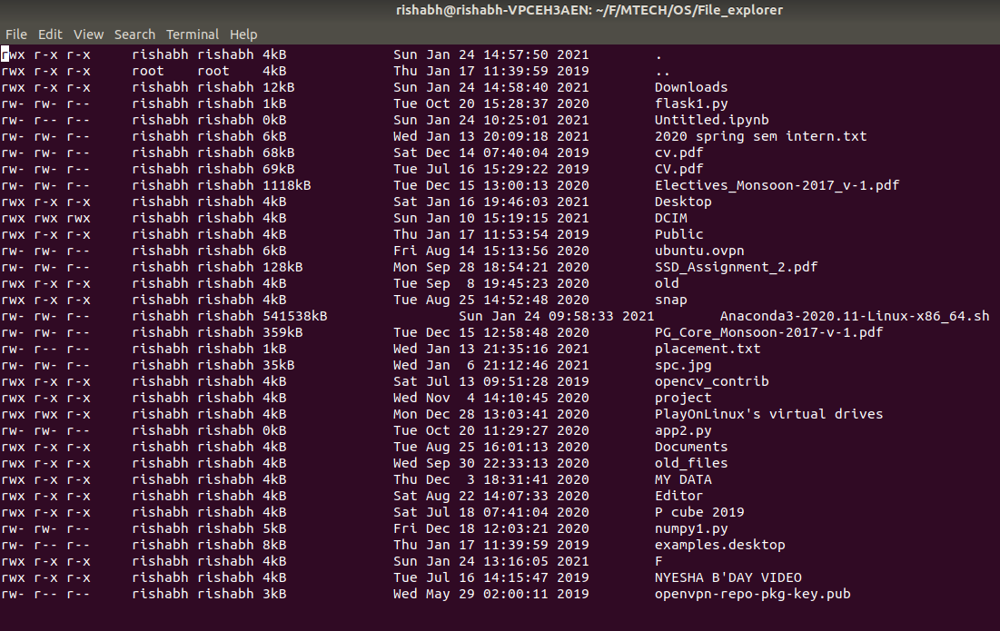

# Treminal-Based File Explorer

### About :
This File Explorer works in two modes -<br/>
**1. Normal mode (default mode) -** used to explore the current directory and navigate the filesystem
**2. Command mode -** used to enter shell commands
The root of application is the home directory of the system.<br/>
The application displays data starting from the top-left corner of the terminal window, line-by-line. The last few lines of the display screen is used as a status bar.<br/>
<p align="center">
  
</p>

### Normal mode:
Normal mode is the default mode of your application. It should have the following functionalities -<br/>
**1.** Display a list of directories and files in the current folder<br/>
&emsp;**a.** Every file in the directory should be displayed on a new line with the following attributes for each file -<br/>
&emsp;&emsp;&emsp;**i.** File Name<br/>
&emsp;&emsp;&emsp;**ii.** File Size<br/>
&emsp;&emsp;&emsp;**iii.** Ownership (user and group) and Permissions<br/>
&emsp;&emsp;&emsp;**iv.** Last modified<br/>
All of this should be displayed in human readable format
&emsp;**b.** The file explorer should show entries “.” and “..” for current and parent directory respectively<br/>
&emsp;**c.** The file explorer should handle scrolling in the case of vertical overflow using arrow keys ( or you can use k  &  l)<br/>
&emsp;**d.** User should be able to navigate up and down in the file list using the corresponding up
and down arrow keys<br/>
**2. Open directories and files**<br/>
When enter key is pressed -<br/>
&emsp;**a.** Directory - Clear the screen and navigate into the directory and show the directory contents as specified in point 1<br/>
&emsp;**b.** File - Open the file in vi editor<br/>
**3. Traversal**<br/>
&emsp;**a.** Go back - Left arrow key should take the user to the previously visited directory<br/>
&emsp;**b.** Go forward - Right arrow key should take the user to the next directory<br/>
&emsp;**c.** Up one level - Backspace key should take the user up one level<br/>
&emsp;**d.** Home -  h  key should take the user to the home folder (the folder where the application was started)

### Command Mode:
The application enters the Command button whenever **“:” (colon) key** is pressed. In the command mode, the user should be able to enter different commands. All commands appear in the status bar at the bottom.

**2.1 copy, move and rename** 
```
copy <source_file(s)> <destination_directory>
move <source_file(s)> <destination_directory>
```
```
Eg:
copy foo.txt bar.txt baz.mp4 ~/foobar
move foo.txt bar.txt baz.mp4 ~/foobar
rename foo.txt bar.txt
```
Copying / Moving of directories is also be implemented

**2.2 create files and directories** 
```
create_file <file_name> <destination_path>
create_dir <dir_name> <destination_path>
```

```
Eg:
create_file foo.txt ~/foobar
create_file foo.txt .
create_dir folder_name ~/foobar
```

**2.3 delete files and directories** 
```
delete_file <file_path>
delete_dir <directory_path>
```

```
Eg:
delete_file ~/foobar/foo.txt.
delete_dir ~/foobar/folder_name
```

**2.4 goto** 
```
goto <directory_path>
```

```
Eg:
goto /home/darshan/
goto ~
```

**2.5 Search a file or folder given fullname.** 
```
search <filename>
```
```
Eg:
search foo.txt
```
Search for the given filename under the current directory recursively
### Assumptions:
You can use both absolute and relative paths whereever required.


